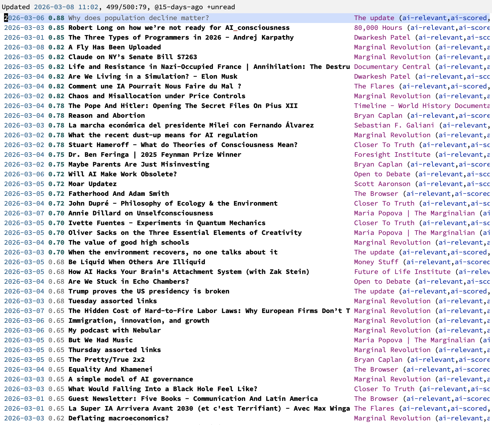

# `elfeed-ai`: AI-powered content curation for elfeed

`elfeed-ai` brings AI-powered relevance scoring to [elfeed](https://github.com/skeeto/elfeed), the Emacs feed reader, via [gptel](https://github.com/karthink/gptel). Describe your interests in natural language, and `elfeed-ai` evaluates every new entry against that profile, scoring them for relevance and optionally showing you a quick AI-generated summary before you read the full article.



Instead of scanning hundreds of entries manually, you write a short interest profile once—or point to a file containing a detailed one—and let a language model do the triage. Scores are stored as entry metadata, so you can sort by relevance.

Key capabilities:

- **Automatic scoring**: new entries are scored asynchronously as they arrive, with scores and summaries stored as elfeed metadata.
- **Search buffer integration**: a color-coded score column appears next to each entry, and you can sort by score instead of date.
- **Show buffer summaries**: AI-generated summaries are injected above the original content for a quick overview.
- **Budget control**: daily usage limits in tokens or dollars prevent runaway API costs.
- **Transient menu**: a centralized menu (`elfeed-ai-menu`) for adjusting all settings on the fly—model, thresholds, budget, and more.

## Installation

Requires Emacs 29.1 or later, plus [elfeed](https://github.com/skeeto/elfeed) (3.4.1+), [gptel](https://github.com/karthink/gptel) (0.9+), and [transient](https://github.com/magit/transient) (0.7+).

### package-vc (Emacs 30+)

```emacs-lisp
(package-vc-install "https://github.com/benthamite/elfeed-ai")
```

### Elpaca

```emacs-lisp
(use-package elfeed-ai
  :ensure (elfeed-ai :host github :repo "benthamite/elfeed-ai"))
```

### straight.el

```emacs-lisp
(straight-use-package
 '(elfeed-ai :type git :host github :repo "benthamite/elfeed-ai"))
```

## Quick start

```emacs-lisp
(require 'elfeed-ai)

(setq elfeed-ai-interest-profile
      "<a description of your interests>")

(elfeed-ai-mode 1)
```

Run `M-x elfeed-update` as usual. New entries are scored automatically. Scores appear in the search buffer and you can sort by relevance. To also filter by tag, set `elfeed-ai-relevance-threshold` (e.g., `0.5`), and entries above that score will be tagged `elfeed-ai`—then filter with `+elfeed-ai +unread`.

To score entries that arrived before you enabled the mode, use `M-x elfeed-ai-score-unscored`. `elfeed-ai` will then score all and only the entries published in a number of past days equal to `elfeed-ai-score-unscored-days` (set to `7` by default).

You can explore other relevant commands and user options with `M-x elfeed-ai-menu`.

## Documentation

For a comprehensive description of all user options, commands, and functions, see the [manual](README.org).

## FAQ

**Q: How expensive is this?**

A: The cost depends on how many feeds you have and what model you use. With `gemini-flash-lite-latest` (as of early March 2026), the cost per 100 entries was less than $0.10. You can see historical costs in the ‘Budget’ section of `elfeed-ai-menu`, and set daily limits with `elfeed-ai-daily-budget` (defaults to $1).
